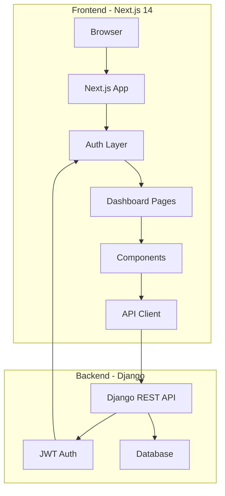
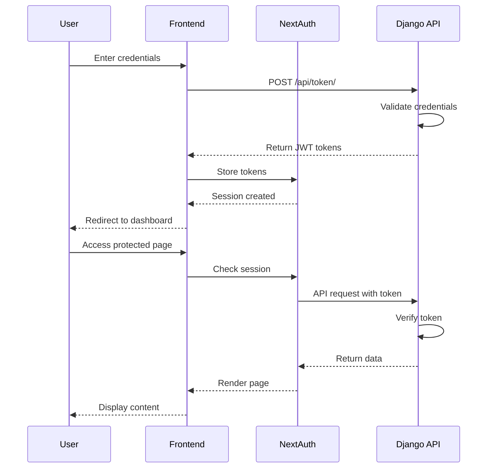
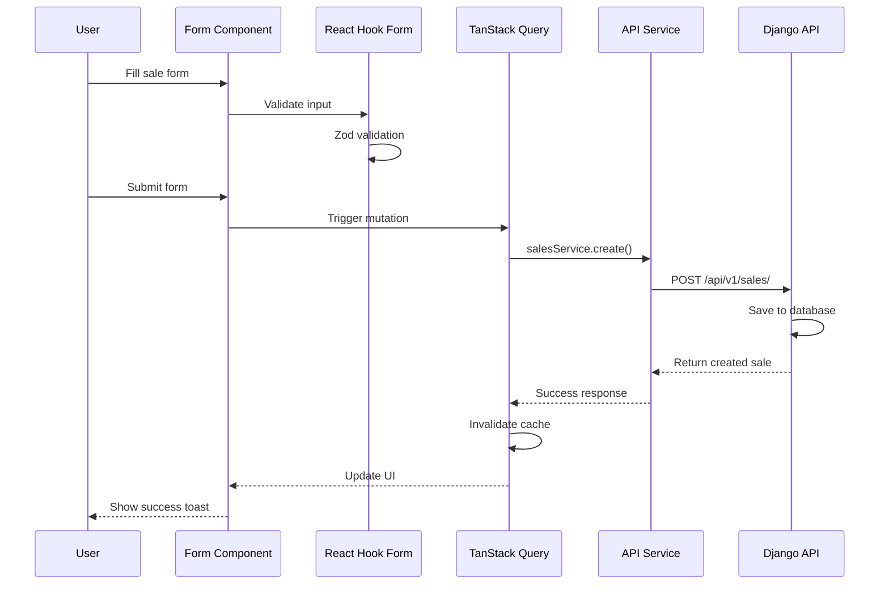
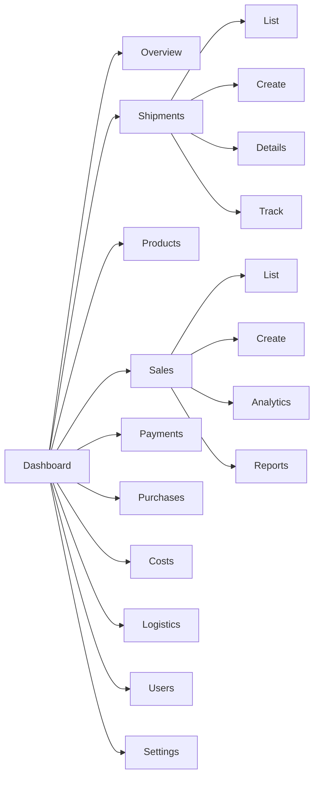
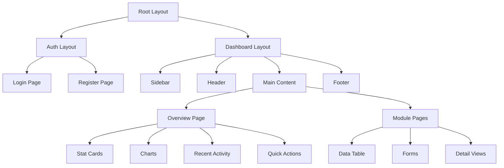

# SeaFood Dashboard - Architecture & Design Plan

## Project Overview

A professional, premium Next.js 14 dashboard for managing SeaFood business operations including shipments, sales, inventory, payments, and logistics.

## Technology Stack

### Frontend
- **Framework**: Next.js 14+ (App Router)
- **Language**: TypeScript
- **UI Library**: Shadcn/ui + Tailwind CSS
- **Authentication**: NextAuth.js with JWT
- **State Management**: React Context + TanStack Query (React Query)
- **Charts**: Recharts / Chart.js
- **Forms**: React Hook Form + Zod validation
- **Tables**: TanStack Table (React Table v8)
- **Date Handling**: date-fns
- **HTTP Client**: Axios

### Backend Integration
- **API**: Django REST Framework
- **Authentication**: JWT (SimpleJWT)
- **Base URL**: `/api/v1/`

## Design System

### Color Palette
```css
Primary: #7C86F5 (Indigo Blue)
Secondary: #AFB5F7 (Light Lavender)
Background: #E5E7F9 (Very Light Blue)
Accent: #5B67D8 (Darker Blue for hover states)
Success: #10B981 (Green)
Warning: #F59E0B (Amber)
Error: #EF4444 (Red)
Neutral: #64748B (Slate)
```

### Typography
- **Headings**: Poppins (600, 700 weights)
- **Body**: Inter (400, 500, 600 weights)
- **Monospace**: JetBrains Mono (for codes/IDs)

### Spacing & Layout
- Container max-width: 1440px
- Sidebar width: 280px (collapsed: 80px)
- Header height: 64px
- Border radius: 8px (cards), 6px (buttons)
- Shadows: Subtle elevation system

## Project Structure

```
seafood-dashboard/
├── public/
│   └── logo/                    # Logo assets
│       ├── logo.svg
│       ├── logo-icon.svg
│       └── logo-white.svg
├── src/
│   ├── app/                     # Next.js App Router
│   │   ├── (auth)/             # Auth group
│   │   │   ├── login/
│   │   │   └── register/
│   │   ├── (dashboard)/        # Dashboard group
│   │   │   ├── layout.tsx      # Dashboard layout with sidebar
│   │   │   ├── page.tsx        # Overview dashboard
│   │   │   ├── shipments/
│   │   │   ├── products/
│   │   │   ├── sales/
│   │   │   ├── payments/
│   │   │   ├── purchases/
│   │   │   ├── costs/
│   │   │   ├── logistics/
│   │   │   ├── users/
│   │   │   └── settings/
│   │   ├── api/                # API routes
│   │   │   └── auth/
│   │   ├── layout.tsx          # Root layout
│   │   └── globals.css
│   ├── components/
│   │   ├── ui/                 # Shadcn components
│   │   ├── layout/
│   │   │   ├── Sidebar.tsx
│   │   │   ├── Header.tsx
│   │   │   └── Footer.tsx
│   │   ├── dashboard/
│   │   │   ├── StatCard.tsx
│   │   │   ├── RecentActivity.tsx
│   │   │   └── QuickActions.tsx
│   │   ├── charts/
│   │   │   ├── SalesChart.tsx
│   │   │   ├── RevenueChart.tsx
│   │   │   └── ShipmentStatusChart.tsx
│   │   ├── tables/
│   │   │   └── DataTable.tsx
│   │   └── forms/
│   │       ├── ShipmentForm.tsx
│   │       ├── SaleForm.tsx
│   │       └── ProductForm.tsx
│   ├── lib/
│   │   ├── api/
│   │   │   ├── client.ts       # Axios instance
│   │   │   ├── endpoints.ts    # API endpoints
│   │   │   └── services/       # API service functions
│   │   │       ├── shipments.ts
│   │   │       ├── sales.ts
│   │   │       ├── products.ts
│   │   │       └── ...
│   │   ├── auth/
│   │   │   └── auth-options.ts # NextAuth config
│   │   ├── utils.ts
│   │   └── constants.ts
│   ├── types/
│   │   ├── api.ts              # API response types
│   │   ├── models.ts           # Data models
│   │   └── index.ts
│   ├── hooks/
│   │   ├── useAuth.ts
│   │   ├── useShipments.ts
│   │   ├── useSales.ts
│   │   └── ...
│   ├── contexts/
│   │   └── ThemeContext.tsx
│   └── middleware.ts           # Auth middleware
├── .env.local
├── .env.example
├── next.config.js
├── tailwind.config.ts
├── tsconfig.json
└── package.json
```

## Core Features & Modules

### 1. Authentication System
- Login page with email/password
- JWT token management (access + refresh)
- Protected routes middleware
- Role-based access control (RBAC)
- User profile management

### 2. Dashboard Overview
**Key Metrics Cards:**
- Total Revenue (with trend)
- Active Shipments
- Pending Payments
- Total Products

**Charts:**
- Revenue over time (line chart)
- Sales by product category (pie chart)
- Shipment status distribution (bar chart)
- Cost breakdown by category (donut chart)

**Recent Activity:**
- Latest sales
- Recent shipments
- Pending payments

**Quick Actions:**
- Create new shipment
- Record sale
- Add product
- Log cost

### 3. Shipments Module
**Features:**
- List all shipments with status badges
- Filter by status, date, country
- Create new shipment with items
- Edit shipment details
- Track shipment status (Created → In Transit → Received → Completed)
- View shipment items (products)
- Associated costs, sales, and receipts
- Timeline view of shipment lifecycle

**Data Display:**
- Shipment ID
- Country of origin
- Currency
- Status
- Created date
- Total items
- Total value

### 4. Products & Categories Module
**Features:**
- Product catalog with categories
- Add/edit/deactivate products
- Category management
- Unit of measure management
- Product search and filtering
- Bulk import/export

**Data Display:**
- Product name
- Category
- Unit of measure
- Status (active/inactive)
- Description

### 5. Sales Module
**Features:**
- Record new sales
- View sales history
- Filter by date, shipment, currency
- Sales analytics dashboard
- Revenue calculations with currency conversion
- Profit margin analysis
- Export sales reports

**Data Display:**
- Sale ID
- Shipment reference
- Quantity sold (kg)
- Selling price
- Currency
- Exchange rate
- Converted amount
- Total sale amount
- Date
- Entered by

**Analytics:**
- Sales trends over time
- Top-selling products
- Revenue by currency
- Sales by user/location

### 6. Payments Module
**Features:**
- Track payments for sales
- Payment status (pending/received)
- Expected vs actual payment dates
- Payment reminders
- Outstanding payments dashboard
- Payment history

**Data Display:**
- Payment ID
- Buyer name
- Sale reference
- Amount paid
- Currency
- Expected date
- Actual date
- Status

### 7. Supplier Purchases Module
**Features:**
- Record purchases from suppliers
- Link to shipments
- Upload receipt images
- Purchase history
- Supplier analytics

**Data Display:**
- Purchase ID
- Shipment reference
- Kg purchased
- Currency
- Receipt image
- Date
- Entered by

### 8. Cost Ledger Module
**Features:**
- Record all operational costs
- Categorize costs (Transport, Freezing, Storage, etc.)
- Link costs to shipments
- Currency conversion
- Cost analytics by category
- Budget tracking

**Cost Categories:**
- Transport
- Freezing
- Cold Storage
- Packing Materials
- Labor
- Commissions
- Export Fees
- Fuel
- Accommodation
- Meals
- Miscellaneous

**Data Display:**
- Cost ID
- Shipment reference
- Category
- Amount
- Currency
- Exchange rate
- Converted amount
- Date
- Entered by

**Analytics:**
- Cost breakdown by category
- Cost trends over time
- Cost per shipment
- Cost efficiency metrics

### 9. Logistics Receipts Module
**Features:**
- Record goods received
- Track losses (transport, freezing)
- Net received quantity
- Facility location tracking
- Receipt notes

**Data Display:**
- Receipt ID
- Shipment reference
- Net received (kg)
- Transport loss (kg)
- Freezing loss (kg)
- Facility location
- Notes
- Date
- Entered by

### 10. Users & Roles Module
**Features:**
- User management (CRUD)
- Role-based permissions
- User activity logs
- Location-based access
- User profiles

**Data Display:**
- User ID
- Full name
- Email
- Role
- Location
- Status (active/inactive)
- Last login
- Created date

### 11. Currency & Exchange Rates Module
**Features:**
- Manage currencies
- Update exchange rates
- Rate history
- Automatic rate sync (if API available)
- Rate comparison

**Data Display:**
- Currency code
- Currency name
- Symbol
- Exchange rates (from/to)
- Rate date
- Last updated

## UI Components Library

### Shadcn/ui Components to Use
- Button
- Card
- Dialog/Modal
- Dropdown Menu
- Form (Input, Select, Textarea, Checkbox)
- Table
- Tabs
- Badge
- Avatar
- Alert
- Toast/Sonner
- Calendar/Date Picker
- Command (search)
- Popover
- Separator
- Sheet (mobile sidebar)
- Skeleton (loading states)
- Switch
- Tooltip

### Custom Components
- **StatCard**: Display KPI metrics with icons and trends
- **DataTable**: Reusable table with sorting, filtering, pagination
- **ChartCard**: Wrapper for charts with titles and legends
- **StatusBadge**: Color-coded status indicators
- **CurrencyDisplay**: Format currency with symbol
- **DateRangePicker**: Select date ranges for filtering
- **FileUpload**: Image/document upload component
- **EmptyState**: Display when no data available
- **LoadingSpinner**: Loading indicators
- **ConfirmDialog**: Confirmation modals for destructive actions

## Data Flow & State Management

### API Integration Pattern
```typescript
// Using TanStack Query for data fetching
const { data, isLoading, error } = useQuery({
  queryKey: ['shipments', filters],
  queryFn: () => shipmentsService.getAll(filters)
});

// Mutations for create/update/delete
const mutation = useMutation({
  mutationFn: shipmentsService.create,
  onSuccess: () => {
    queryClient.invalidateQueries(['shipments']);
    toast.success('Shipment created successfully');
  }
});
```

### Authentication Flow
1. User enters credentials
2. POST to `/api/token/` → receive access + refresh tokens
3. Store tokens in httpOnly cookies (via NextAuth)
4. Include access token in Authorization header
5. Refresh token automatically when expired
6. Redirect to login on 401 errors

### Form Validation
```typescript
// Using Zod + React Hook Form
const shipmentSchema = z.object({
  country_origin: z.string().min(1),
  currency: z.string().uuid(),
  status: z.enum(['CREATED', 'IN_TRANSIT', 'RECEIVED', 'COMPLETED']),
  items: z.array(z.object({
    product: z.string().uuid(),
    quantity: z.number().positive(),
    price_at_shipping: z.number().positive()
  }))
});
```

## Responsive Design Strategy

### Breakpoints
- Mobile: < 640px
- Tablet: 640px - 1024px
- Desktop: > 1024px

### Mobile Adaptations
- Collapsible sidebar (sheet/drawer)
- Stacked cards instead of grid
- Horizontal scrolling tables
- Bottom navigation for quick actions
- Touch-friendly button sizes (min 44px)

## Performance Optimizations

1. **Code Splitting**: Dynamic imports for heavy components
2. **Image Optimization**: Next.js Image component
3. **Data Pagination**: Server-side pagination for large datasets
4. **Caching**: TanStack Query cache + stale-while-revalidate
5. **Lazy Loading**: Virtualized lists for long tables
6. **Debouncing**: Search inputs debounced
7. **Optimistic Updates**: Immediate UI feedback

## Security Considerations

1. **Authentication**: JWT with httpOnly cookies
2. **Authorization**: Role-based access control
3. **CSRF Protection**: CSRF tokens for mutations
4. **XSS Prevention**: Sanitize user inputs
5. **API Security**: CORS configuration
6. **Environment Variables**: Secure API keys
7. **Input Validation**: Client + server-side validation

## Accessibility (a11y)

1. Semantic HTML elements
2. ARIA labels and roles
3. Keyboard navigation support
4. Focus management
5. Color contrast compliance (WCAG AA)
6. Screen reader support
7. Alt text for images

## Testing Strategy

1. **Unit Tests**: Component logic (Jest + React Testing Library)
2. **Integration Tests**: API integration
3. **E2E Tests**: Critical user flows (Playwright)
4. **Type Safety**: TypeScript strict mode

## Deployment

### Environment Variables
```env
NEXT_PUBLIC_API_URL=http://localhost:8000/api/v1
NEXTAUTH_URL=http://localhost:3000
NEXTAUTH_SECRET=your-secret-key
```

### Build Process
1. `npm run build` - Production build
2. Static optimization for pages
3. Image optimization
4. Bundle analysis

### Hosting Options
- Vercel (recommended for Next.js)
- Netlify
- AWS Amplify
- Docker container

## Development Workflow

1. **Setup**: Initialize Next.js project with TypeScript
2. **Configuration**: Tailwind, Shadcn/ui, NextAuth
3. **Foundation**: Layout, navigation, auth
4. **API Integration**: Services, types, hooks
5. **Features**: Build modules incrementally
6. **Polish**: Animations, loading states, error handling
7. **Testing**: Write tests for critical paths
8. **Documentation**: Component docs, API docs

## Future Enhancements

1. **Real-time Updates**: WebSocket for live data
2. **Notifications**: Push notifications for important events
3. **Advanced Analytics**: Predictive analytics, forecasting
4. **Mobile App**: React Native version
5. **Offline Support**: PWA with offline capabilities
6. **Multi-language**: i18n support
7. **Dark Mode**: Theme switching
8. **Advanced Reporting**: Custom report builder
9. **Audit Logs**: Comprehensive activity tracking
10. **API Documentation**: Interactive API docs

## Mermaid Diagrams

### System Architecture



### Authentication Flow



### Data Flow - Creating a Sale



### Dashboard Module Structure



### Component Hierarchy



## Design Mockup Descriptions

### Dashboard Overview
- **Header**: Logo, search bar, notifications, user profile dropdown
- **Sidebar**: Navigation menu with icons, collapsible
- **Main Area**:
  - Row 1: 4 stat cards (Revenue, Shipments, Payments, Products)
  - Row 2: 2 charts (Revenue trend, Shipment status)
  - Row 3: Recent activity table + Quick actions panel

### Shipments List Page
- **Filters**: Status, date range, country, search
- **Table**: Columns - ID, Country, Status, Items, Value, Date, Actions
- **Actions**: View, Edit, Delete buttons
- **Pagination**: Bottom of table
- **Create Button**: Top right, prominent

### Shipment Detail Page
- **Header**: Shipment ID, status badge, action buttons
- **Tabs**:
  - Overview: Basic info, items list
  - Sales: Related sales
  - Costs: Associated costs
  - Logistics: Receipt information
  - Timeline: Status history

### Sales Analytics Page
- **Date Range Selector**: Top
- **KPI Cards**: Total sales, average sale, top product
- **Charts**:
  - Sales over time (line)
  - Sales by product (bar)
  - Revenue by currency (pie)
- **Top Products Table**: Below charts

## Color Usage Guidelines

### Primary Color (#7C86F5)
- Primary buttons
- Active navigation items
- Links
- Focus states
- Important badges

### Secondary Color (#AFB5F7)
- Secondary buttons
- Hover states
- Subtle backgrounds
- Borders

### Background Color (#E5E7F9)
- Page background
- Card backgrounds (lighter variant)
- Sidebar background
- Input backgrounds

### Status Colors
- Success: #10B981 (Completed, Paid, Active)
- Warning: #F59E0B (Pending, In Transit)
- Error: #EF4444 (Failed, Overdue, Inactive)
- Info: #3B82F6 (Created, Processing)

## Typography Scale

```css
/* Headings */
h1: 2.5rem (40px) - Poppins 700
h2: 2rem (32px) - Poppins 600
h3: 1.5rem (24px) - Poppins 600
h4: 1.25rem (20px) - Poppins 600
h5: 1.125rem (18px) - Poppins 600

/* Body */
body: 1rem (16px) - Inter 400
small: 0.875rem (14px) - Inter 400
xs: 0.75rem (12px) - Inter 400

/* Weights */
Regular: 400
Medium: 500
Semibold: 600
Bold: 700
```

## Icon System

**Library**: Lucide React (consistent, modern icons)

**Common Icons**:
- Home: Home
- Shipments: Package
- Products: Box
- Sales: TrendingUp
- Payments: CreditCard
- Purchases: ShoppingCart
- Costs: DollarSign
- Logistics: Truck
- Users: Users
- Settings: Settings
- Search: Search
- Filter: Filter
- Export: Download
- Add: Plus
- Edit: Edit
- Delete: Trash2
- View: Eye

## Summary

This architecture provides a solid foundation for a professional, scalable SeaFood dashboard. The tech stack is modern and production-ready, the design system is cohesive and premium, and the feature set comprehensively covers all business operations.

The modular structure allows for incremental development, and the use of TypeScript ensures type safety throughout. The combination of Next.js 14, Shadcn/ui, and Tailwind CSS provides excellent developer experience and performance.

The dashboard will be responsive, accessible, and user-friendly, with a focus on data visualization and efficient workflows for managing seafood business operations.
